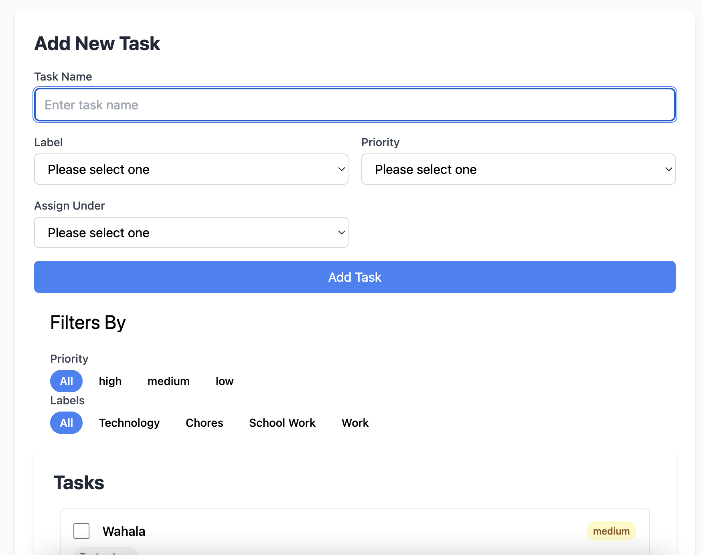

# Hierarchical Todo List Application

A full-stack task management application built with Laravel 8.2, Vue.js, and Inertia.js that allows users to create and manage hierarchical todo lists with priorities and labels.



## Features

- ✅ Task Creation and Management
    - Create unlimited nested tasks
    - Set task priorities (high, medium, low)
    - Assign custom labels (Technology, Work, School Work, Chores)
    - Mark tasks as complete

- 🏷️ Task Organization
    - Filter tasks by priority
    - Filter tasks by labels
    - Hierarchical task structure
    - Visual task status indicators

- 👥 User Management
    - User authentication
    - Personal todo lists for each user
    - Secure data isolation

## Tech Stack

- **Backend:**
    - Laravel 8.2
    - PHP 8.2
    - MySQL Database
    - RESTful API endpoints

- **Frontend:**
    - Vue.js
    - Inertia.js
    - Node.js 20
    - Responsive UI design
    - Tailwind

## Installation

1. Clone the repository:
```bash
git clone [repository-url]
```

2. Install PHP dependencies:
```bash
composer install
```

3. Install Node.js dependencies:
```bash
npm install
```

4. Create environment file:
```bash
cp .env.example .env
```

5. Configure your database in `.env` file:
```
DB_CONNECTION=mysql
DB_HOST=127.0.0.1
DB_PORT=3306
DB_DATABASE=your_database_name
DB_USERNAME=your_username
DB_PASSWORD=your_password
```

6. Run database migrations:
```bash
php artisan migrate
```

7. (Optional) Seed the database with sample data:
```bash
php artisan db:seed
```

## Testing

Run the test suite using:
```bash
php artisan test
```

## Application Structure

Based on the screenshot, the application includes:

- **Task Management:**
    - Task creation form with name input
    - Priority selection (high, medium, low)
    - Label assignment (Technology, Chores, School Work, Work)
    - Task assignment hierarchy

- **Filtering System:**
    - Priority-based filtering
    - Label-based filtering
    - All/specific category views

- **User Interface:**
    - Clean, intuitive design
    - Visual priority indicators
    - Task completion checkboxes
    - Hierarchical task display

## Development Notes

- The application uses Inertia.js to bridge Laravel and Vue.js, providing a seamless SPA experience
- Authentication is implemented for multi-user support
- Database design supports hierarchical task relationships
- RESTful API endpoints handle all CRUD operations

## Security

- User authentication required
- Data isolation between users
- CSRF protection
- Secure session management

